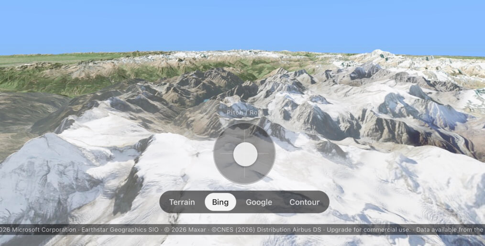

# react-native-cesium

> [!WARNING]
> This library is under development and may not work correctly in all cases yet.
>

Experimental Cesium rendering for React Native using [Nitro Modules](https://github.com/mrousavy/nitro), with the native Metal/Vulkan renderer powered by [Cesium Native](https://github.com/CesiumGS/cesium-native).



## Status

- Platform maturity: **under development**
- Supported renderers: Metal (iOS) and Vulkan (Android)
- Native engine: **Cesium Native**
- React Native integration: **Nitro host component + imperative hybrid ref API**

## Requirements

- React Native **new architecture**
- React Native Nitro Modules is a dependency
- Follow the native build instructions below: additional setup is required by you.
- A valid Cesium Ion access token and asset IDs for your content (get these from https://ion.cesium.com)
- **Disk and time:** building Cesium Native pulls **vcpkg** dependencies, can use **several GB** of disk, and often takes a long time on first build.

## Installation

First install the Nitro Modules runtime dependency:

```bash
yarn add react-native-nitro-modules
```

or:

```bash
npm install react-native-nitro-modules
```

Then add `react-native-cesium`:

```bash
yarn add react-native-cesium
```

or:

```bash
npm install react-native-cesium
```


## Building Cesium Native locally

The package **does not include** the required iOS or Android Cesium Native libraries. Generate them locally by compiling **Cesium Native** with the required toolchains.

### System dependencies

These are **not** installed by `yarn add` / `pod install`. Install them on your local machine first.

#### Shared (both iOS and Android)

| Tool | Typical install (macOS) | Why |
| --- | --- | --- |
| **CMake** | `brew install cmake` | Configures and drives the native build |
| **Ninja** | `brew install ninja` | Required generator on macOS for the bundled build script |
| **Git** | Xcode includes `/usr/bin/git` | Clones Cesium Native and vcpkg |
| **Python 3** | Usually present on macOS; `brew install python@3` if needed | Some vcpkg/port steps expect a working `python3` |

Optional but recommended for faster or more reliable builds (see [Cesium Native developer setup](https://github.com/CesiumGS/cesium-native/blob/main/doc/topics/developer-setup.md)):

- **`nasm`** — `brew install nasm` (speeds some JPEG-related builds in dependency trees)

Ensure Homebrew’s binary directory is on your **`PATH`** when you run the build (typically `/opt/homebrew/bin` on Apple Silicon or `/usr/local/bin` on Intel Macs). The build script also tries to prepend common Homebrew paths for nested CMake/vcpkg processes.

<details>
<summary><strong>Additional iOS specific requirements</strong></summary>

- **Xcode** or Command Line Tools: `xcode-select --install` (or install Xcode from the App Store)
- Needed for Apple `clang`, SDKs, and `xcodebuild` (XCFramework assembly)

</details>

<details>
<summary><strong>Additional Android specific requirements</strong></summary>

- Install **Android Studio**
- In SDK Manager, install:
  - **Android SDK**
  - **NDK** (the project currently uses `27.1.12297006`)
- Ensure **Java 17 (JDK)** is available (Android Studio bundled JDK is fine)

For Android builds, make sure one of these is set so the NDK can be discovered:

- `ANDROID_NDK_HOME` (explicit NDK path), or
- `ANDROID_SDK_ROOT` / `ANDROID_HOME` with an installed NDK under `ndk/`

If `ANDROID_NDK_HOME` is unset, the build script will try to auto-detect the latest installed NDK from your SDK directory.

</details>

### Required Podfile hooks (iOS)

Your app **`ios/Podfile`** must **`require`** two helpers from this package and call them in **`pre_install`** and **`post_install`**.

**Top of the Podfile** (paths assume the default `node_modules` layout):

```ruby
require_relative "../node_modules/react-native-cesium/ios/react_native_cesium_ensure_native"
require_relative "../node_modules/react-native-cesium/ios/react_native_cesium_post_install"
```

**`pre_install`** (runs before pods resolve; triggers automatic Cesium Native clone/build when the XCFramework is missing):

```ruby
pre_install do |installer|
  react_native_cesium_ensure_native
end
```

**`post_install`** (header search paths and simulator arch exclusions):

```ruby
post_install do |installer|
  react_native_post_install(
    installer,
    config[:reactNativePath],
    :mac_catalyst_enabled => false
  )
  react_native_cesium_post_install(installer)
end
```

The **post-install** helper is currently needed to:

- prepend this package's `cpp/` headers before the locally built XCFramework headers
- exclude `x86_64` iOS simulator builds, because the simulator slice is Apple Silicon `arm64` only

### Android (Gradle automatic ensure-native)

Unlike iOS, you **do not** need to copy anything into your **application’s** `android/build.gradle` (or `settings.gradle`) so Cesium Native can be cloned and built automatically. React Native already includes this package as an Android library dependency; this repo’s **`android/build.gradle`** registers **`ensureCesiumNativeAndroid`** and makes **`preBuild`** depend on it.

What happens on **`./gradlew`** / Android Studio build:

1. **`preBuild`** runs **`ensureCesiumNativeAndroid`** before CMake compiles the JNI/native code.
2. That task checks for a marker file under the installed package:  
   `vendor/android/share/cesium-native/cmake/cesium-nativeConfig.cmake`.
3. If the marker **exists**, the task does nothing.
4. If the marker is **missing**, it runs (from the package root, e.g. `node_modules/react-native-cesium`):  
   `node scripts/cesium/ensure-native.mjs --android`  
   which may run **`update`** then a **`CESIUM_BUILD_ONLY=android`** **`build`**, same as a manual run (can take a long time).
5. If **`REACT_NATIVE_CESIUM_SKIP_NATIVE_BUILD=1`** is set and artifacts are still missing, the build **fails fast** with an error instead of running the script.

You still need a discoverable **Android NDK** (expand **Additional Android specific requirements** under [System dependencies](#system-dependencies) above) so that build can succeed.

**Maintainers:** verify Android builds with **Gradle 9.3+** (as in React Native 0.85+ templates; this repo’s example app uses the wrapper under `example/android/gradle/wrapper/`).

### Building

**Automatic (default):** assuming you have done the above and have all the required dependencies in place, when the native output is missing, the package tries to build it for you:

- **iOS:** add **`pre_install`** in your app **`Podfile`** (one-time; see [Required Podfile hooks](#required-podfile-hooks-ios)) so **`pod install`** runs **`scripts/cesium/ensure-native.mjs --ios`**, which runs **`npm run update`** / **`yarn run update`** (if needed) and then **`CESIUM_BUILD_ONLY=ios`** build. The first run can take **a long time** and needs the same **system dependencies** as a manual build (CMake, Ninja, Xcode, disk space, etc.).
- **Android:** no extra hooks in your app; see [Android (Gradle automatic ensure-native)](#android-gradle-automatic-ensure-native). Needs a discoverable **NDK**.

**Manual (optional):** run the **`update`** and **`build`** scripts defined in **`react-native-cesium`’s `package.json`**. They are **not** available as top-level commands in your app; you must run them **in the context of the installed package**.

From your **application project root** (where your app’s `package.json` lives), after `yarn add` / `npm install`:

**Yarn:**

```bash
yarn --cwd node_modules/react-native-cesium run update
yarn --cwd node_modules/react-native-cesium run build
```

**npm:**

```bash
npm run update --prefix node_modules/react-native-cesium
npm run build --prefix node_modules/react-native-cesium
```

**Alternative:** `cd node_modules/react-native-cesium` and run `yarn run update` / `yarn run build` (or the equivalent `npm run …`).

**Yarn/npm workspaces:** if `react-native-cesium` is a workspace package in your monorepo, use your tool’s workspace runner, e.g. `yarn workspace react-native-cesium run update` (exact syntax depends on your workspace layout).

- `update` checks out **Cesium Native `v0.59.0`** into `vendor/cesium-native` under the package (next to its other files; typically ignored in app repos).
- `build` runs `scripts/cesium/build.mjs` (**CMake**, **vcpkg** under `vendor/vcpkg` unless **`VCPKG_ROOT`** is set, **Ninja** on macOS) and writes **`vendor/ios/CesiumNative.xcframework`** and/or **`vendor/android`** depending on **`CESIUM_BUILD_ONLY`**.

Then install pods (iOS):

```bash
cd ios && pod install && cd ..
```

## Usage

The public JS surface is exported from `react-native-cesium`:

- `CesiumView`
- `CameraState`
- `Quaternion`
- `CesiumMetrics`
- `CesiumViewProps`
- `CesiumViewMethods`

Minimal usage:

```tsx
import React, { useRef } from 'react'
import { StyleSheet, View } from 'react-native'
import { callback } from 'react-native-nitro-modules'
import {
  CesiumView,
  type CameraState,
  type CesiumMetrics,
  type CesiumViewMethods,
} from 'react-native-cesium'

const initialCamera: CameraState = {
  latitude: 46.02,
  longitude: 7.6,
  altitude: 5800,
  heading: 220,
  pitch: -20,
  roll: 0,
  verticalFovDeg: 60,
}

export function GlobeScreen() {
  const cesiumRef = useRef<CesiumViewMethods | null>(null)

  return (
    <View style={styles.container}>
      <CesiumView
        hybridRef={callback((ref: CesiumViewMethods | null) => {
          cesiumRef.current = ref
        })}
        style={styles.fill}
        ionAccessToken="YOUR_CESIUM_ION_ACCESS_TOKEN"
        ionAssetId={1}
        initialCamera={initialCamera}
        pauseRendering={false}
        maximumScreenSpaceError={16}
        maximumSimultaneousTileLoads={8}
        loadingDescendantLimit={20}
        msaaSampleCount={4}
        ionImageryAssetId={2}
        // Optional perf / quality knobs (see "Optional performance / quality knobs" below).
        // Omit to use the built-in defaults; values shown here are typical for a high-end phone.
        maximumCachedMiB={384}
        preloadAncestors
        forbidHoles
        enableLodTransitionPeriod
        onMetrics={callback((metrics: CesiumMetrics) => {
          console.log('Cesium FPS:', metrics.fps)
        })}
      />
    </View>
  )
}

const styles = StyleSheet.create({
  container: { flex: 1 },
  fill: { flex: 1 },
})
```

### Nitro `hybridRef` requirement

When you pass a callback ref to `CesiumView`, wrap it with `callback(...)` from `react-native-nitro-modules`. Plain callback functions do not make it across the React Native bridge correctly for this component.

## API

### `CesiumViewProps`

`CesiumView` is a Nitro host component. In addition to standard view props like `style`, it currently expects these Cesium-specific props:

**Consumer-required props (TypeScript)**

| Prop | Type | Default | Description                                                                                                                                                                                                  |
| --- | --- | --- |--------------------------------------------------------------------------------------------------------------------------------------------------------------------------------------------------------------|
| `ionAccessToken` | `string` | _none_ | Cesium Ion token for authenticated asset/imagery requests. An invalid token usually leaves the globe empty or partially loaded due to 401/403 responses.                                                     |
| `ionAssetId` | `number` | _none_ | Main Ion asset to render (tileset/terrain).                                                                                                                                                                  |
| `initialCamera` | `CameraState` | _none_ | Camera applied via `teleport(...)` once when the view is created. **Only the initial mount writes this value**; subsequent prop changes are ignored. Use the per-DoF setters (`setPosition` / `setAltitude` / `setHeading` / `setAttitude` / `setVerticalFov`) or `teleport(...)` for runtime moves. |
| `pauseRendering` | `boolean` | `false` | Pauses the native render loop. Set `true` to stop rendering and reduce GPU/CPU usage.                                                                                                                        |
| `maximumScreenSpaceError` | `number` | `32` | Quality/performance trade-off for tile refinement. Lower values are sharper (more work); higher values are faster/blurrier.                                                                                  |
| `maximumSimultaneousTileLoads` | `number` | `12` | Max concurrent tile fetch/decode operations. Raising `8 -> 16` can improve fast camera moves on good networks but may increase memory/bandwidth spikes.                                                      |
| `loadingDescendantLimit` | `number` | `20` | Caps descendant tile fan-out during traversal. Lower values like `10` smooth bursts on low-end devices; higher values like `40` can fill detail faster.                                                      |
| `msaaSampleCount` | `number` | `1` | Anti-aliasing sample count. Both backends support `1`, `2`, `4`, or `8`; the value is clamped to the largest sample count the physical device can frame-buffer (Metal: `device.supportsTextureSampleCount`, Vulkan: `framebufferColorSampleCounts & framebufferDepthSampleCounts`). On tiled mobile GPUs the multisample colour buffer is allocated `LAZILY_ALLOCATED` where supported, so MSAA's memory cost is largely on-chip. |
| `ionImageryAssetId` | `number` | `1` | Imagery layer to drape over terrain/tiles. Use a satellite imagery asset for a photoreal look, or switch to a streets/map layer for legibility. See your Cesium Ion Asset IDs. |

**Consumer-optional props (TypeScript)**

| Prop | Type | Default | Description |
| --- | --- | --- | --- |
| `onMetrics` | `(metrics: CesiumMetrics) => void` | `undefined` | Receives throttled runtime stats and credits text. |

**Optional performance / quality knobs**

These props are all optional. Leave them unset to use the built-in defaults; set them to override per-screen for fine-grained control. They are runtime-mutable: changing them at any time after the view has mounted re-applies to the live tileset (no engine rebuild) except where noted.

| Prop | Type | Default | Description |
| --- | --- | --- | --- |
| `maximumCachedMiB` | `number` | `256` | RAM budget (mebibytes) for decoded geometry / textures held by the live tileset. Lower values (e.g. `128`) reduce peak memory on entry-level devices; higher values (`512+`) keep more tiles resident across long pans. |
| `preloadAncestors` | `boolean` | `true` | Pre-load ancestor tiles around the visible set. Smoother panning at higher load pressure. |
| `preloadSiblings` | `boolean` | `true` | Pre-load sibling tiles around the visible set. Same trade-off as `preloadAncestors`. |
| `forbidHoles` | `boolean` | `true` | When `true`, Cesium keeps coarser ancestor tiles visible until all children load. Setting to `false` during fast pans reduces upload pressure at the cost of brief visible "holes". |
| `enableWaterMask` | `boolean` | `true` | Decode the per-tile water-mask texture used for coastline shading and the ocean-vs-land hypsometric branch. Disable to save bandwidth on memory-constrained devices. |
| `enableFogCulling` | `boolean` | `false` | When `true`, tiles fully inside the atmospheric fog volume are culled before refinement. |
| `enforceCulledScreenSpaceError` | `boolean` | `true` | When `enableFogCulling` is `true`, allow fogged tiles to refine to a coarser SSE — saves work on tiles that will never be visually scrutinised. |
| `culledScreenSpaceError` | `number` | `64` | The relaxed SSE applied to fogged tiles when `enforceCulledScreenSpaceError` is `true`. |
| `enableLodTransitionPeriod` | `boolean` | `false` | Cross-fade between LODs as tiles refine instead of hard-popping. Smoother visually; very small per-frame cost. |
| `lodTransitionLength` | `number` | `1.0` | Length in seconds of the LOD cross-fade when `enableLodTransitionPeriod` is `true`. |
| `sqliteCacheMaxRows` | `number` | `4096` | Maximum number of cached HTTP responses Cesium keeps in `cesium_cache.db` between sessions. Tablets can comfortably go to `16384`. **Re-applied only on the next view init** — runtime changes take effect after the next mount. |
| `taskProcessorThreads` | `number` | `0` (auto) | Worker pool size for tile parsing / texture decode. `0` (default) auto-sizes to `clamp(2, std::thread::hardware_concurrency() - 1, 8)`. Override for benchmarking or to throttle background CPU on shared-render apps. **Re-applied only on the next view init.** |
| `maxYawRateDegSec` | `number` | `0` (uncapped, but compile-time default `360`) | Hard ceiling on the integrator's heading velocity (deg/s). Useful when your heading feed is noisy and you would rather drop a sudden spike than visually spin the camera. |
| `maxPitchRateDegSec` | `number` | `0` (uncapped, but compile-time default `360`) | Hard ceiling on the integrator's pitch velocity (deg/s). |
| `maxRollRateDegSec` | `number` | `0` (uncapped, but compile-time default `720`) | Hard ceiling on the integrator's roll velocity (deg/s). |
| `maxClimbRateMps` | `number` | `0` (uncapped) | Hard ceiling on the integrator's altitude velocity (m/s). |
| `maxGroundSpeedMps` | `number` | `0` (uncapped) | Hard ceiling on the integrator's horizontal ground velocity (m/s). |

#### Suggested presets

The defaults are tuned for current-generation phones (e.g. iPhone 13/Pixel 6 and newer). Useful starting points for other classes of device:

| Profile | `maximumScreenSpaceError` | `maximumSimultaneousTileLoads` | `maximumCachedMiB` | `forbidHoles` | `enableLodTransitionPeriod` |
| --- | --- | --- | --- | --- | --- |
| **High-end / tablet** | `16` | `16` | `512` | `true` | `true` |
| **Default / phone** | `32` | `12` | `256` | `true` | `false` |
| **Battery-saver / low-end** | `48` | `6` | `128` | `false` | `false` |

### `CameraState`

```ts
type CameraState = {
  latitude: number
  longitude: number
  altitude: number
  heading: number
  pitch: number
  roll: number
  verticalFovDeg: number
}
```

| Field | Type | Valid range / format         | Description                                                                                           |
| --- | --- |------------------------------|-------------------------------------------------------------------------------------------------------|
| `latitude` | `number` | `-90..90`                    | Camera latitude in degrees.                                                                           |
| `longitude` | `number` | `-180..180`                  | Camera longitude in degrees.                                                                          |
| `altitude` | `number` | Meters above sea level (MSL) | Camera height in meters.                                                                              |
| `heading` | `number` | Degrees                      | Compass direction the camera faces. Example: `0` faces north, `90` faces east.                        |
| `pitch` | `number` | Degrees                      | Tilt angle. Negative values look downward toward terrain; positive values tilt up toward horizon/sky. |
| `roll` | `number` | Degrees                      | Bank/rotation around forward axis. Positive right bank, negative left bank.                           |
| `verticalFovDeg` | `number` | `20..100` (clamped)          | Vertical field of view in degrees; see **Field of view** (next section).                              |

### Field of view: vertical vs horizontal, full vs half, and Cesium alignment

Use this when matching **Skia**, **custom HUDs**, or **CesiumJS** math to the same frustum as this view.

| Concept | What this library uses |
| --- | --- |
| **API field** | `verticalFovDeg` is the **full** vertical aperture in **degrees** (top to bottom through the view axis), not a half-angle and not the horizontal FOV. |
| **Horizontal FOV** | Not stored. With viewport width `w` and height `h` in pixels and `aspect = w / h`, the native tile `ViewState` uses **full** vertical FOV `vfov_rad = radians(verticalFovDeg)` and **full** horizontal FOV `hfov_rad = 2 * atan(tan(vfov_rad / 2) * aspect)`. |
| **Half-angles** | The projection uses the usual symmetric perspective form: `tan(vfov_rad / 2)` (and the same pattern horizontally via aspect). Those are **half** of the full vertical/horizontal FOV, in radians—standard for `tan` of frustum slopes, not an alternate “FOV definition.” |
| **Cesium Native `ViewState`** | `GlobeCamera` passes that `vfov_rad` and `hfov_rad` into `Cesium3DTilesSelection::ViewState` together with the viewport size—consistent with **full-angle** vertical/horizontal FOV in radians for culling. |
| **CesiumJS `PerspectiveFrustum` / `Camera.frustum`** | **Comparable vertical angle:** In CesiumJS, `PerspectiveFrustum#fovy` is the **full vertical** FOV in **radians** (derived from `fov` and `aspectRatio`). This package’s `verticalFovDeg` is always **vertical** in **degrees**; use `vfov_rad = Cesium.Math.toRadians(verticalFovDeg)` (or equivalent) to compare to `fovy` when the **same aspect ratio** and symmetric frustum assumptions apply. This repo uses **Cesium Native**, not CesiumJS—tile culling uses `ViewState` with `vfov_rad` / `hfov_rad` as above, not the JS frustum object. |

### `Quaternion`

Used for **camera-space view correction** with `setViewCorrection(q)` (see below). Components are `w, x, y, z` (Hamilton convention). Non-unit values are normalized on the native side.

```ts
type Quaternion = {
  w: number
  x: number
  y: number
  z: number
}
```

### `CesiumViewMethods`

Each axis (position, altitude, heading, attitude, viewCorrection, verticalFov) has its own α-β tracker on the native side, so you only need to push the values that actually changed. Combined with a `teleport(...)` for hard jumps and a `getActualCamera()` / `getDemandCamera()` pair for read-back, this is the entire camera API.

| Method | Signature | Description |
| --- | --- | --- |
| `setPosition` | `(latitude: number, longitude: number) => void` | New geographic position **demand** (degrees). Each call stamps the measurement with the native steady-clock time of arrival and runs one α-β update against the predicted state at that instant. Latitude is clamped to ±90 on extrapolation; longitude is continuous (no wrap normalisation) so shortest-arc residual maths stays correct across the antimeridian. |
| `setAltitude` | `(altitudeMeters: number) => void` | New altitude demand (metres MSL). |
| `setHeading` | `(headingDeg: number) => void` | New heading demand (degrees; `0` = north, increasing clockwise). The integrator computes the shortest-arc residual, so feeding it `359 → 1` rotates 2° clockwise, not 358° counter-clockwise. |
| `setAttitude` | `(pitchDeg: number, rollDeg: number) => void` | New pitch and roll demand (degrees). Bundled because almost every IMU emits them together — but you can pass the previous value for either axis if only one of them has changed. |
| `setViewCorrection` | `(q: Quaternion) => void` | New camera-space rotation applied **after** HPR. SLERPed toward the latest demand each frame. Use for boresight calibration, screen-fixed HUD alignment, etc. Non-unit values are normalised on the native side. |
| `setVerticalFov` | `(deg: number) => void` | New vertical FOV demand (degrees). Clamped to `20..100` on the native side. |
| `teleport` | `(camera: CameraState) => void` | Hard scene jump — atomically resets every DoF (value, velocity, demand) to `camera`. Bypasses the integrator entirely. Use for `Fly to coordinate` actions or seeding from saved state. |
| `getActualCamera` | `() => Promise<CameraState>` | Most recently rendered camera (post-integration). This is what the user is currently looking at and what a HUD overlay should mirror. Differs from `getDemandCamera()` while a glide is in progress or when the terrain-floor clamp has raised the altitude. |
| `getDemandCamera` | `() => Promise<CameraState>` | What the consumer last asked for (per-DoF demand). Useful for diagnostics, or for showing the requested camera alongside the rendered one. |
| `getViewCorrection` | `() => Promise<Quaternion>` | Current view-correction quaternion (smoothed toward the latest demand). Identity (`w=1, x=y=z=0`) if you have never called `setViewCorrection`. |

#### Threading: setters vs getters

| Call style | Supported / best practice |
| --- | --- |
| **`setPosition` / `setAltitude` / `setHeading` / `setAttitude` / `setViewCorrection` / `setVerticalFov` / `teleport`** | **Synchronous** native updates. **Supported** from the **UI thread**, including **Reanimated worklets** and **`useAnimatedReaction`** when you call through a Nitro `hybridRef`. The integrator takes its mutex briefly (uncontested in practice) and returns immediately — this is the intended path for high-frequency camera updates (e.g. a 50 Hz IMU feed). |
| **`getActualCamera` / `getDemandCamera` / `getViewCorrection`** | **Async** (`Promise`). **Call from the JavaScript thread** (e.g. `useEffect`, handlers, throttled HUD state) — not from worklets — unless you have a clear, tested pattern for async in your runtime. |

Avoid assuming **main-thread-only** vs **JS-thread-only** labels beyond the above: Nitro invokes the hybrid object on the thread that called the method; use sync setters on the UI/worklet path you already use for gestures, and reserve Promise-based getters for JS.

#### Choosing the right setter

- Stream **only what changed**. A 1 Hz GPS fix that does not move you should not call `setPosition` every second; a 50 Hz IMU does not need to call `setPosition` at all.
- Use **`teleport`** when the new camera has no continuous relationship to the previous one — "Fly to coordinate", loading a saved view, an in-app scene switch. Teleport zeroes velocity, so the camera will start gliding from rest the next time a setter is called.
- Use **`setViewCorrection(identity)`** to clear a calibration quaternion. `teleport` deliberately preserves the latest view-correction target — it is a position/orientation jump, not a boresight reset.

#### Demand vs actual camera

The integrator tracks two camera states simultaneously:

- **Demand** — what the consumer asked for, exactly as it was passed to the setters. `getDemandCamera()` returns this.
- **Actual** — what the integrator extrapolated to and what was passed to the GPU on the last frame. `getActualCamera()` returns this.

For a steady GPS feed with no terrain clamp the two values converge within a few frames. They diverge when:

- A glide is in progress (you just called `setPosition` and the α-β tracker is still chasing the demand).
- The terrain-floor clamp (`minAltitudeAboveTerrain`) has raised the actual altitude above the demand.
- A sudden change is in flight and you want to display the requested value rather than the partially-tracked one (e.g. a HUD).

`hudCamera` in the example app reads from `getActualCamera()` via a worklet-side mirror so what the user sees in the HUD matches what is on screen.

#### Smoothing of incoming camera updates

Every value you pass to a setter is treated as a **demand** target — what you would *like* the camera to be — rather than a per-frame command. The native render thread runs an α-β (constant-velocity) tracker per DoF and extrapolates to the next vsync, which means a coarse 1 Hz position feed (e.g. external GPS) does **not** teleport the view once a second. Instead it moves at the implied ground speed between fixes — exactly like looking out the window of the vehicle being tracked.

| DoF | Smoothing |
| --- | --- |
| `latitude` / `longitude` | α-β tracker. Velocity is learned from inter-arrival times. Steady at constant motion (zero lag at constant ground speed), gliding through brief network gaps. Optional outlier rejection (`kOutlierLatLonDeg`) drops a single measurement whose residual exceeds the threshold. |
| `altitude` | α-β tracker. Self-adapts whether altitude comes from GPS (1 Hz, learned m/s climb) or a barometer (50 Hz, ≈zero glide). |
| `heading` | α-β tracker, residual on shortest-arc angular delta. Antimeridian-safe. Yaw rate is the learned velocity, capped by `maxYawRateDegSec`. |
| `pitch` / `roll` | α-β tracker, residual on shortest-arc angular delta. Constant-rate roll/pitch under steady IMU input; capped by `maxPitchRateDegSec` / `maxRollRateDegSec`. |
| `viewCorrection` (quaternion) | Single-coefficient SLERP toward the latest demand each frame, hemisphere-corrected. |
| `verticalFovDeg` | α-only (no velocity term). |

You don't have to do anything special to take advantage of this — the integrator runs whenever a frame is rendered, regardless of whether your driver is a Reanimated worklet at 60 Hz, a `setInterval` push at 10 Hz, or a 1 Hz GPS subscription. Just call the appropriate per-DoF setter when you have a new value, and call `teleport(...)` when you want to bypass smoothing entirely.

Each DoF also tracks the EWMA of its measurement inter-arrival time and bleeds the learned velocity exponentially once measurements stop arriving (silence > `1.5 ×` mean interval). This keeps a 60 Hz worklet feed from "coasting" the camera after the user releases a pan gesture or returns the joystick to centre, while leaving a 1 Hz GPS glide untouched between fixes — bleed never engages unless the sensor falls measurably behind its usual cadence.

If the smoothing ever feels off for your data source, the relevant constants live in [`cpp/engine/EngineTunables.hpp`](cpp/engine/EngineTunables.hpp): `kAlphaPos` / `kBetaPos`, `kAlphaAlt` / `kBetaAlt`, `kAlphaHdg` / `kBetaHdg`, `kAlphaPitch` / `kBetaPitch`, `kAlphaRoll` / `kBetaRoll`, `kAlphaVfov`, `kAlphaViewCorr`. The velocity bleed is tuned via `kVelocitySilenceGraceFactor`, `kVelocityBleedTauFactor`, and `kIntervalEwmaAlpha`. Per-DoF rate caps and optional outlier thresholds are also defined there (`kMaxYawRateDegSec`, `kMaxPitchRateDegSec`, `kMaxRollRateDegSec`, `kMaxClimbRateMps`, `kMaxGroundSpeedMps`, `kMaxFrameDtSec`, `kOutlierLatLonDeg`, `kOutlierAltMeters`, `kOutlierHeadingDeg`). Use the `maxYawRateDegSec` etc. view props to override the caps at runtime.

#### Driving the camera from native sensors

High-rate sensors can feed their matching setter directly — there is no need to round-trip through a shared `CameraState` value:

```ts
gpsSubscription.on('fix', (fix) => {
  cesiumViewRef.current?.setPosition(fix.latitude, fix.longitude)
  cesiumViewRef.current?.setAltitude(fix.altitudeMsl)
})

imuSubscription.on('attitude', (att) => {
  cesiumViewRef.current?.setHeading(att.yawDeg)
  cesiumViewRef.current?.setAttitude(att.pitchDeg, att.rollDeg)
})
```

Each setter is synchronous, takes the integrator's mutex briefly, and is safe to call at any rate from any thread.

### `CesiumMetrics`

| Field | Type | Description                                                                                                                                 |
| --- | --- |---------------------------------------------------------------------------------------------------------------------------------------------|
| `fps` | `number` | Smoothed frames-per-second estimate from the native render loop.                                                                            |
| `tilesRendered` | `number` | Number of tiles currently rendered in the frame.                                                                                            |
| `tilesLoading` | `number` | Number of tiles still loading. If this stays high for long periods, reduce load pressure (`maximumSimultaneousTileLoads`) or check network. |
| `tilesVisited` | `number` | Number of tiles visited during traversal/culling.                                                                                           |
| `ionTokenConfigured` | `boolean` | Whether a non-empty Ion token is configured natively. `false` is a quick signal to check `ionAccessToken`.                                  |
| `tlsConfigured` | `boolean` | Whether libcurl resolved a CA bundle for HTTPS. `false` means TLS to `api.cesium.com` may fail; on iOS verify `cacert.pem` is in the main bundle, on Android that the asset is bundled (the package ships one for you). |
| `tilesetReady` | `boolean` | Whether the primary tileset is initialized and ready.                                                                                       |
| `creditsPlainText` | `string` | Plain-text attribution/credits from Cesium data sources. Display this in your app footer to satisfy attribution requirements.               |

## Example App

The example app in [`example/App.tsx`](./example/App.tsx) is the best current integration reference. It shows:

- creating and storing a Nitro `hybridRef`
- driving camera updates via per-DoF setters from a Reanimated **`useAnimatedReaction`** (see [`example/hooks/useCameraController.ts`](./example/hooks/useCameraController.ts)) — note how the reaction diffs each DoF and only calls the setters that actually changed
- a one-shot `getActualCamera()` after mount so the gesture-handler pan anchors track the terrain-clamped altitude (see same hook)
- the `setViewCorrection` / `getViewCorrection` APIs for camera-space HUD alignment (the example does not demonstrate them yet; see **`CesiumViewMethods`** above)
- listening to `onMetrics`
- switching imagery layers
- presenting Cesium attribution from `creditsPlainText`

Before running the example, copy `example/.env_example` to `example/.env` and set `CESIUM_ION_ACCESS_TOKEN` to your own token. Restart Metro after editing `.env` so the env transform is reapplied.

The example project currently links this library locally via `link:..`.

## Troubleshooting

### Noisy logs during fast refresh

When React Native fast-refresh (or `r` from the Metro terminal) tears down
the current bundle and re-mounts the view, you may briefly see one or both
of the following in the device log:

- `[AsyncJSCallback] Failed to call AsyncJSCallback<...> - the Dispatcher has already been destroyed!`
- `[SqliteCache.cpp:...] database is locked`

Both are harmless. The first means a queued `onMetrics` callback reached the
JS side after the old runtime's dispatcher had already been torn down; the
view's render-thread teardown drops the callback before invoking it on the
next refresh. The second comes from Cesium Native's `SqliteCache` and only
appears when a new `CesiumView` opens the on-disk tile cache while the old
one is still in the process of releasing it; the cache writer simply skips
the contended row and retries on the next request. Neither indicates a
bug in your code, and neither appears in release builds without
fast-refresh churn.

If you do see these in production (i.e., not during fast refresh), make
sure you are not mounting two `<CesiumView />` instances against the same
cache directory simultaneously.

## Credits

- Native rendering is built on [Cesium Native](https://github.com/CesiumGS/cesium-native)
- Cesium Native is licensed under Apache 2.0; see [`NOTICE`](./NOTICE)
- EGM96 altitude offset calculations using [EGM96](https://github.com/emericg/EGM96)
- React Native integration is built with [Nitro Modules](https://github.com/mrousavy/nitro)


